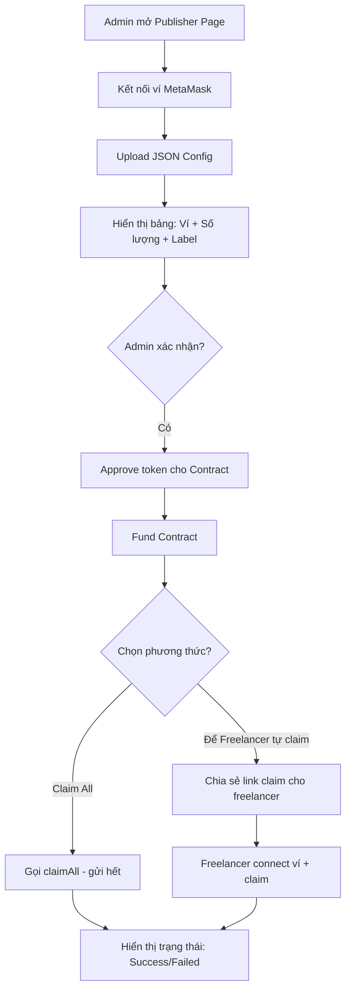

# IP-025: Smart Contract Claim USDT/USDC — Thanh toán Freelancer & Thưởng

## 1. Mục tiêu

Xây dựng hệ thống Smart Contract trên mạng Ethereum cho phép **claim USDT/USDC tự động**, phục vụ việc thanh toán cho freelancer và chi trả thưởng. Hệ thống bao gồm: Smart Contract (on-chain), file cấu hình JSON (off-chain), và một trang web Publisher để fund tiền + upload danh sách claim.

## 2. Lý do (Why)

- **Thanh toán freelancer hiện tại thủ công:** Mỗi lần thanh toán phải chuyển khoản từng ví một, tốn thời gian và dễ sai sót — đặc biệt khi số lượng freelancer/người nhận tăng lên.
- **Thiếu minh bạch:** Freelancer không có cách verify trước rằng khoản tiền đã được cam kết (funded) cho họ. Phải tin tưởng hoàn toàn vào lời hứa.
- **Smart Contract đảm bảo tính trustless:** Tiền fund vào contract được cam kết cho freelancer — freelancer tự claim, không cần đợi bên A chuyển. Admin có cơ chế `withdraw()` để rút lại token chưa claim, tránh bị đóng băng vĩnh viễn.
- **Có khả năng sửa lỗi (Error Correction):** Admin có thể cập nhật/sửa/xóa claim entry nếu nhập sai địa chỉ ví hoặc sai số tiền — trước khi freelancer claim. Tránh tình huống gửi nhầm mà không thể sửa.
- **Tự động hóa quy trình:** Thay vì gửi 10 transactions riêng lẻ, chỉ cần 1 lần fund + upload config → tất cả tự claim.

## 3. Kết quả Then chốt (Key Results)

- [ ] **KR1:** Smart Contract (Solidity) deploy trên Ethereum mainnet, hỗ trợ cả USDT và USDC, với các chức năng:
  - `claim()` — người nhận tự claim phần tiền của mình.
  - `claimAll()` — owner/admin gửi tiền đến tất cả ví đích trong 1 transaction.
  - Fund contract bằng USDT/USDC.
  - `withdraw()` — admin rút token chưa được claim (tránh đóng băng).
  - Config danh sách ví + số lượng qua on-chain hoặc Merkle tree.
  - **Error Correction:** `updateClaim(address, newAmount)` — sửa số tiền; `removeClaim(address)` — xóa claim entry; `revokeClaim(address)` — thu hồi claim đã cấp nhưng chưa được claim. Tất cả chỉ hoạt động trước khi freelancer đã claim.
- [ ] **KR2:** File JSON config chuẩn hóa, định nghĩa danh sách claim:
  - Địa chỉ ví (wallet address).
  - Số lượng token (amount).
  - Loại token (USDT/USDC).
  - Metadata tùy chọn (tên freelancer, mục đích thanh toán).
- [ ] **KR3:** Publisher Page (Web App) hoàn chỉnh với các tính năng:
  - Kết nối ví (MetaMask / WalletConnect).
  - Upload file JSON config.
  - Hiển thị danh sách các ví + số lượng để admin double-check trước khi fund.
  - Nút "Fund Contract" — approve + transfer token vào contract.
  - Nút "Distribute All" — gọi `claimAll()` để gửi tiền đến tất cả ví đích.
  - Hiển thị trạng thái claim của từng ví (Pending / Claimed / Failed).
- [ ] **KR4:** Bộ test (unit test + testnet deployment) đảm bảo contract hoạt động đúng trên Sepolia testnet trước khi deploy mainnet.
- [ ] **KR5:** Tài liệu hướng dẫn sử dụng (User Guide) cho admin và cho người nhận (claimer).
- [ ] **KR6:** Toàn bộ quy trình (upload JSON → fund → distribute) cho **30 freelancer** hoàn thành trong **dưới 15 phút**, bao gồm thời gian confirm transaction trên Ethereum.

## 4. Thiết kế Kỹ thuật (Technical Design)

### 4.1. Smart Contract Architecture

```
┌─────────────────────────────────────────────┐
│              ClaimVault.sol                  │
│                                             │
│  ┌─────────────────────────────────────┐    │
│  │  Storage                            │    │
│  │  - owner (admin)                    │    │
│  │  - token (USDT/USDC address)        │    │
│  │  - claims: mapping(address => uint) │    │
│  │  - claimed: mapping(address => bool)│    │
│  │  - merkleRoot (optional)            │    │
│  └─────────────────────────────────────┘    │
│                                             │
│  Core Functions:                              │
│  - fund(amount) → admin nạp token             │
│  - setClaims(addresses[], amounts[])          │
│  - claim() → claimer tự rút                   │
│  - claimAll() → admin gửi hết một lượt        │
│  - withdraw() → admin rút token chưa claim    │
│                                                │
│  Error Correction:                             │
│  - updateClaim(addr, newAmt) → sửa số tiền    │
│  - removeClaim(addr) → xóa claim entry        │
│  - revokeClaim(addr) → thu hồi claim chưa rút │
│                                                │
│  View Functions:                               │
│  - getClaim(address) → xem số tiền claim       │
│  - getStatus() → trạng thái tổng               │
│  - getUnclaimedTotal() → tổng chưa claim       │
│                                             │
│  Events:                                    │
│  - Funded(amount, token)                    │
│  - Claimed(address, amount)                 │
│  - ClaimsConfigured(count, totalAmount)     │
│  - Distributed(count, totalAmount)          │
└─────────────────────────────────────────────┘
```

### 4.2. JSON Config Format

```json
{
  "token": "USDT",
  "network": "ethereum",
  "claims": [
    {
      "address": "0x1234...abcd",
      "amount": "500.00",
      "label": "Alice — Design work March 2026"
    },
    {
      "address": "0x5678...efgh",
      "amount": "1200.00",
      "label": "Bob — Backend development"
    }
  ]
}
```

### 4.3. Publisher Page — User Flow



## 5. Kế hoạch (Plan)

### Giai đoạn 1 — Smart Contract Development

1. **Viết Smart Contract (Solidity):**
   - Contract `ClaimVault.sol` với các function: `fund()`, `setClaims()`, `claim()`, `claimAll()`, `withdraw()`.
   - Error Correction functions: `updateClaim()`, `removeClaim()`, `revokeClaim()` — chỉ hoạt động khi freelancer chưa claim.
   - Hỗ trợ ERC-20 (USDT: 6 decimals, USDC: 6 decimals).
   - Access control: Owner-only cho `setClaims`, `claimAll`, `withdraw`, error correction functions.
   - Re-entrancy guard, overflow protection.
2. **Viết Unit Tests (Hardhat/Foundry):**
   - Test claim flow, edge cases (double claim, insufficient balance, unauthorized).
   - Test claimAll với nhiều ví (gas estimation).
3. **Deploy lên Sepolia Testnet:**
   - Verify contract trên Etherscan.
   - Test end-to-end với USDT/USDC testnet.

### Giai đoạn 2 — Publisher Page (Frontend)

1. **Xây dựng Publisher Page:**
   - Tech stack: Next.js / Vite + ethers.js / viem + wagmi.
   - Trang upload JSON → parse + hiển thị bảng double-check.
   - Kết nối ví (MetaMask, WalletConnect).
   - Gọi contract: approve → fund → claimAll.
2. **Trang Claim (cho Freelancer):**
   - Freelancer connect ví → hiển thị số tiền có thể claim → nút Claim.
   - Hiển thị lịch sử claim.

### Giai đoạn 3 — Testing & Security

1. **Security Review:**
   - Kiểm tra re-entrancy, integer overflow, access control.
   - Sử dụng Slither / Mythril cho static analysis.
2. **User Acceptance Testing:**
   - Test với nhóm nhỏ (2-3 freelancer thật) trên testnet.
   - Thu thập feedback UX từ Publisher Page.

### Giai đoạn 4 — Mainnet Deployment & Documentation

1. **Deploy lên Ethereum Mainnet:**
   - Verify trên Etherscan.
   - Fund lần đầu + test claim thật.
2. **Viết tài liệu:**
   - Admin Guide: Cách upload JSON, fund, distribute.
   - Claimer Guide: Cách connect ví và claim.
   - Technical Reference: Contract ABI, addresses, supported tokens.

## 6. Rủi ro (Risks)

- *Rủi ro 1:* **Gas cost cao khi claimAll nhiều ví** — Ethereum gas fee có thể rất đắt khi gửi đến 50+ ví trong 1 transaction. → *Mitigation:* Implement batch processing (chia nhỏ thành các batch 20-30 ví). Cân nhắc deploy thêm trên L2 (Arbitrum/Base) nếu gas quá cao.
- *Rủi ro 2:* **USDT không tuân chuẩn ERC-20 hoàn toàn** — USDT trên Ethereum có một số quirk (không return bool trên transfer). → *Mitigation:* Sử dụng OpenZeppelin SafeERC20 library để handle edge cases.
- *Rủi ro 3:* **Lỗ hổng bảo mật Smart Contract** — Bug trong contract có thể dẫn đến mất tiền. → *Mitigation:* Unit test coverage > 95%. Static analysis (Slither). Triển khai trên testnet trước. Giới hạn fund amount ban đầu nhỏ để test.
- *Rủi ro 4:* **Freelancer mất private key / không biết claim** — Người nhận không quen blockchain. → *Mitigation:* Cung cấp hướng dẫn step-by-step. Fallback: admin dùng claimAll để gửi trực tiếp thay vì đợi claim.

## 7. Status

`Chưa bắt đầu`

## 8. Liên kết

- **Finance Management:** [IP-019](./IP-019-doing.md) — Nâng cấp hệ thống tài chính (outcome tracking liên quan)
- **ERC-20 Reference:** USDT (`0xdAC17F958D2ee523a2206206994597C13D831ec7`), USDC (`0xA0b86991c6218b36c1d19D4a2e9Eb0cE3606eB48`)
- **OpenZeppelin Contracts:** [github.com/OpenZeppelin/openzeppelin-contracts](https://github.com/OpenZeppelin/openzeppelin-contracts)

## 9. Thực tế (Ghi chú/Dấu vết)

*(Chưa có — sẽ cập nhật khi bắt đầu triển khai)*
